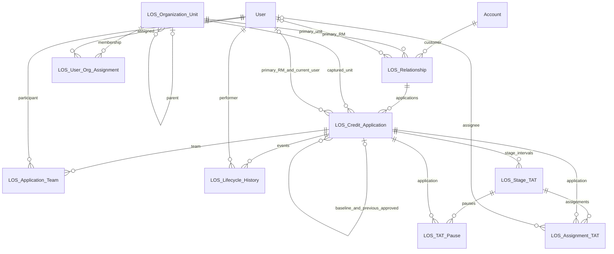
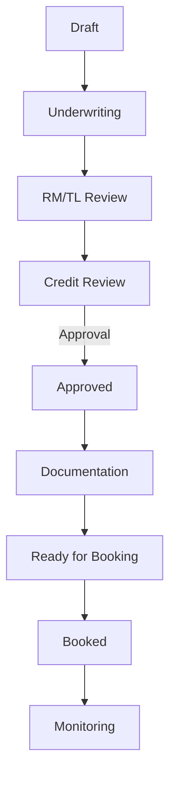
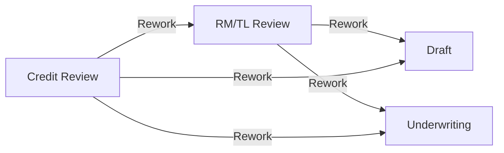

# LOS — configurable commercial lending runtime

Task 02 builds on the Task 01 foundation with application creation, configured lifecycle/rework, gross TAT, pause/resume, validation hooks, and server-side write protection. All product metadata and Apex remain in the single `force-app` package directory. No LWC, Flow, lending module, approval process or booking integration is included.

## Architecture principles

- Client-neutral business behavior comes from Custom Metadata. No production Apex embeds lifecycle stages/paths, application types, personas, organization levels, bank/branch identifiers, or SLA values.
- Public commands accept narrow typed inputs. Callers cannot submit destination stages, organization snapshots, audit actors or measured durations.
- Parent edit access, CRUD/FLS-aware reads, row locks, version checks and guarded writes enforce the runtime independently of UI.
- Every mutation batch is atomic; failure rolls back its application, history, TAT and pause changes. Bulk methods handle up to 200 requests.
- Application organization context is copied once from Relationship and protected against direct edits. It does not automatically follow later Relationship changes.
- Reference organization fixtures remain separate from the package. Namespace registration and managed-package release/install testing remain release work.

## Documentation

- [Runtime architecture, service contracts, security and sequence diagrams](docs/task-02-runtime.md)
- [Every object and field](docs/data-dictionary.md)
- [Task 02 validation, coverage, deployment and Git summary](docs/task-02-validation.md)
- [Task 01 deployment evidence — historical](docs/task-01-validation.md)
- [Optional reference organization fixtures](reference-data/README.md)

## Naming and managed packaging

The requested logical notation `LOS__<Name>__c` cannot be used as a local object name: Salesforce reserves double underscores for namespace and suffix delimiters. Source components use `LOS_<Name>__c`, `LOS_<Name>__mdt` and `LOS_<Field>__c`. Apex (later) uses `LOS_<ClassName>`, LWC uses `los<ComponentName>`, and permission sets use `LOS_<Name>`.

The package namespace is intentionally empty until separately registered. A future namespace `pkg` produces `pkg__LOS_Stage__mdt`; source references remain `LOS_Stage__mdt`. Do not add a literal namespace to source identifiers or assume the registered namespace is `LOS`.

This is a single deployable package foundation, not a released managed package version. Dev Hub package creation, namespace registration/linking, package ID/version creation, upgrade/install validation, and security review remain release tasks. They require packaging choices beyond this development-org deployment.

Salesforce sources: [custom object naming](https://help.salesforce.com/s/articleView?id=platform.dev_objectcreate.htm&language=en_US&type=5), [Custom Metadata creation and manageability](https://help.salesforce.com/s/articleView?id=platform.custommetadatatypes_ui_create.htm&language=en_US&type=5).

## Configuration versus code

The nine public Custom Metadata Types retain subscriber-controlled fields and unprotected reference records. Clients can add types and change lifecycle configuration without changing Apex. Code enforces the command protocol, transaction/security rules and configuration consistency; metadata supplies business values.

| Type (`LOS_…__mdt`) | Responsibility |
|---|---|
| Application_Type | Active type code, explicit initial-stage relationship, baseline requirement and display sequence. |
| Stage | Code, label, sequence, activity, terminal/TAT and approval/documentation/booking flags. |
| Stage_Transition | Directed stage relationships, type scope, protocol type, action label, reason and validation policy. |
| Persona | Extensible business persona catalog; no permission grants. |
| Workspace_Section | Future workspace component/visibility keys, scope and presentation order. |
| Workspace_Action | Future handlers, authorization keys, scope, transition and confirmation behavior. |
| SLA_Rule | Scoped target, warning threshold, priority, effective dates and portable business-hours key. |
| TAT_Pause_Rule | Scoped pause reasons and captured SLA-counting/comments policies. |
| Org_Unit_Type | Generic organization taxonomy without fixed depth or hierarchy semantics. |

The configuration service caches each catalog per transaction and returns immutable wrappers. It validates active stage/type/transition resolution, applies scoped overrides, and rejects ambiguous winning policies. No default persona, SLA duration, UI section, approval authority or regional calendar is invented.

## Core objects

| Object (`LOS_…__c`) | Purpose | Custom fields |
|---|---|---:|
| Organization_Unit | Generic unit hierarchy and effective context. | 6 |
| User_Org_Assignment | Effective-dated many-to-many user/unit membership. | 7 |
| Relationship | Customer relationship, Account, primary RM/unit and current snapshots. | 9 |
| Credit_Application | Service-managed application, captured context, lifecycle/version/rework and lineage. | 20 |
| Application_Team | Effective-dated application participation. | 7 |
| Lifecycle_History | Immutable, service-created transition events. | 9 |
| Stage_TAT | Stage intervals, unique open key, SLA snapshot and measured durations. | 14 |
| Assignment_TAT | Reserved assignment timing model; execution deferred. | 8 |
| TAT_Pause | Controlled pauses with unique open key and captured counting policy. | 8 |

There are 88 core custom fields and 82 configuration fields, excluding standard Name/OwnerId/audit fields. All nine core objects retain Private internal and external OWD. No metadata requirement from Task 01 was removed.

## Object relationships



These are lookups, not master-detail relationships. Diagram cardinality does not imply inherited sharing. OwnerId remains authoritative for Salesforce ownership. Current user/queue fields are operational assignment context only. Queue references use portable `Group.DeveloperName` text because a custom Group lookup is not available; future code must validate the group is a queue and supports the application object, and synchronize OwnerId where required. No queue or QueueSobject assignment is shipped.

## Seed lifecycle



Reference application-type flags require a baseline for Renewal and Modification, but not New. These editable flags are enforced by application creation; an approved, accessible baseline must belong to the same relationship.

Nine stage records are shared across application types. There is one Draft and one Underwriting. Every edge except Credit Review → Approved is Forward; that edge is Approval. All seeded transitions require validation; all rework edges require a reason. No transition-specific validation policies are invented at this phase.

Reference flag assumptions are editable: Credit Review is the approval stage; Documentation is the documentation stage; Ready for Booking and Booked have the booking flag. Monitoring is terminal for origination and has TAT disabled; all earlier stages have TAT enabled. Approved is not terminal because documentation and booking follow. Monitoring operations beyond this graph are deferred.

## Rework transitions



Rework is a transition type, never a lifecycle stage. The lifecycle service increments rework state and records a new stage interval/history event atomically. Text codes preserve historical stage/transition values even when configuration labels change.

## Runtime security and transactions

Use `LOS_ApplicationService`, `LOS_LifecycleService` and `LOS_TATService` remote facades, or their bulk Apex methods. `LOS_Use_Runtime`, application CRUD and native record access are required. Caller-facing reads use user mode. Generated audit/TAT writes use a restricted system-mode boundary after parent authorization; users are not given direct audit/TAT write access.

The two permission sets grant no Delete, View All or Modify All. Lending users now read Relationship context; admins maintain it. Five guard triggers prevent direct application/audit/TAT writes, including deletes and undeletes. Lifecycle History remains protected by its Task 01 validation rule as well. Package installation does not automatically assign permission sets; the Task 01 development admin assignment remains in place.

A lifecycle request must include the DTO's version. The service locks the application, resolves the configured edge, validates, closes TAT, updates state/rework/version, writes history and starts the next enabled interval in one transaction. Stale requests fail even after a rework round trip to the same stage. Pause/resume commands use expected interval/pause IDs and the same parent lock.

Full [creation, lifecycle, rework and TAT sequence diagrams](docs/task-02-runtime.md) document transaction boundaries and error handling.

## Validation and deployment

```sh
python3 scripts/validation/validate_foundation.py
sf project deploy start --source-dir force-app --target-org closDevOrg --dry-run --test-level RunSpecifiedTests --tests LOS_ApplicationServiceTest --tests LOS_LifecycleServiceTest --tests LOS_TATServiceTest --tests LOS_ConfigurationServiceTest --tests LOS_SecurityTest --wait 10
sf project deploy start --source-dir force-app --target-org closDevOrg --test-level RunSpecifiedTests --tests LOS_ApplicationServiceTest --tests LOS_LifecycleServiceTest --tests LOS_TATServiceTest --tests LOS_ConfigurationServiceTest --tests LOS_SecurityTest --wait 10
python3 scripts/validation/verify_deployed.py --target-org closDevOrg --expect-reference-data --output docs/task-02-org-verification.json
```

The Python suite verifies the foundation's graph, namespace safety, configuration manageability, sharing/permission boundaries, required User validation and reference hierarchy. Apex suites exercise runtime behavior, negative security cases and 200-record batches. See [actual results](docs/task-02-validation.md); a deployment test level is not a substitute for those results.

## Assumptions and deferred work

- Status follows the configured stage code. Monitoring remains the reference terminal origination stage; no duplicate Draft/Underwriting or Rework stage is added.
- Renewal/Modification require an accessible approved baseline under their editable reference flags. Approval dates and automatic latest-baseline selection are not implemented here.
- Gross time is measured in UTC, accumulating milliseconds before rounding whole-minute fields down. Business Minutes stays null; a configured calendar produces Pending Calendar SLA status.
- Validation hooks are trusted, registered Apex implementations and must be free of DML/callout side effects. Missing configured hooks fail closed.
- Existing applications with null runtime versions and old open timing records require deliberate migration. No migration or repair bypass is shipped.
- Approval-type graph edges do not execute approval decisions or authority checks. Approvals, booking, business calendars, assignment TAT, Visibility Engine, workspace UI, lending modules, integrations, retention, managed packaging and production concurrency/load/security review remain deferred.

Task 02 stops here for architecture review.
