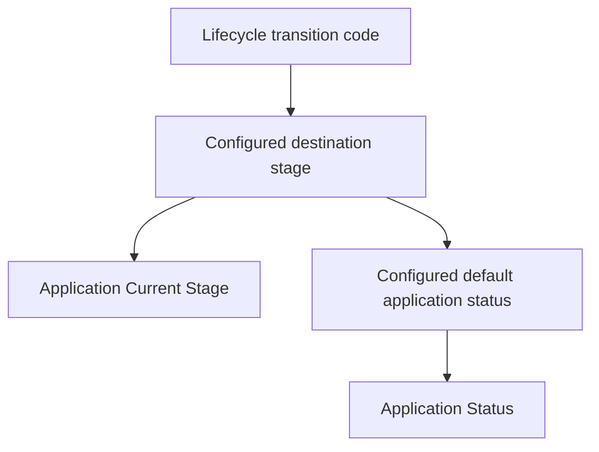
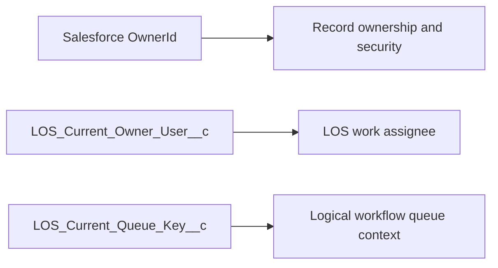
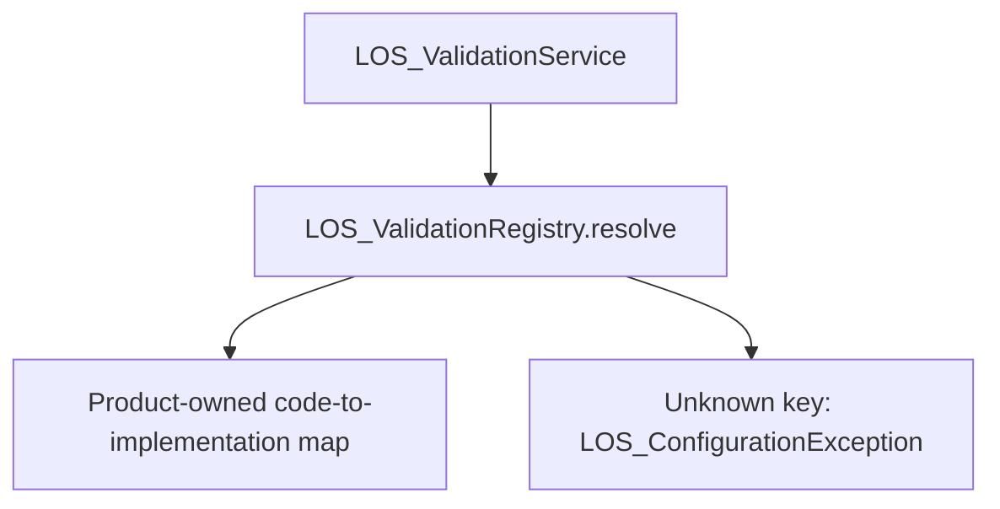

# Task 02.1 — Architecture hardening

## Scope and architecture

This remediation separates application business Status from workflow Stage and adds a controlled validator registry. No Task 01/02 architecture changed beyond the requested remediation. Configuration caching, transition resolution, rework counters, version checks, row locks, atomic rollback, writer/guard authorization, exception hierarchy, TAT uniqueness and business-time abstraction are preserved. No permissions were broadened.

## Stage and Status

Stage identifies the workflow position. Status describes the broader business state. `LOS_Stage__mdt.LOS_Default_Application_Status__c` is subscriber-controlled Text(255). Runtime requires a nonblank value of at most 255 characters with no leading/trailing whitespace. The field is physically optional to support metadata upgrades; absent configuration fails closed at stage resolution with `LOS_ConfigurationException`. There is no fallback or compiled status enumeration.

| Stage code | Default application status |
|---|---|
| Draft | In Progress |
| Underwriting | In Progress |
| RM_TL_Review | In Review |
| Credit_Review | In Review |
| Approved | Approved |
| Documentation | Approved |
| Ready_for_Booking | Approved |
| Booked | Booked |
| Monitoring | Active |

These values are reference metadata. `LOS_ConfigurationService.Config.defaultApplicationStatus` exposes them using the existing cache. Creation uses the configured initial stage; transitions use the configured destination stage. Neither authoritative stage nor status is accepted from callers. Configuration errors leave application, lifecycle history and TAT state unchanged through existing rollback behavior.



Many stages can share a status. Future outcomes such as Rejected, Withdrawn, Cancelled, Expired, On Hold and Closed need not correspond to stages. A future status-specific transition policy can build on this distinction; no full status engine is introduced. Existing application rows are not rewritten by deployment or metadata changes; the next authorized transition applies the destination default. No audit bypass or data migration is included.

## Ownership and work assignment



These fields are independent. There is no invariant that OwnerId equals the LOS work assignee. Future My Applications/My Work and Workspace/Visibility behavior must combine authorized record access with LOS assignment context; an OwnerId-only filter does not implement that contract. Queue keys do not grant access by themselves.

## Application Team principal

The current principal is a User. The existing active `LOS_Required_User` validation rule rejects `ISBLANK(LOS_User__c)` on insert and update; the layout also requires User. Salesforce does not support the native required flag for this User lookup in the existing deployment, so this compatible enforcement remains unchanged. A focused test verifies missing-user rejection, valid insertion and rejection of user removal. No additional permissions are required. A future generic User/Queue/Public Group principal model remains deferred.

## Controlled validation registry



The production map is private and has no dynamic registration API. It currently has no lending validator entries: no such validators are in this task. Future product modules must explicitly add stable policy keys and concrete validator constructors in product code. Metadata supplies a policy key, never an Apex class name. Arbitrary reflection would allow configuration to select unreviewed execution paths and is prohibited.

Tests register fixture implementations through private `@TestVisible registerTestHook`; both registration and resolution are gated by test context, and registration cannot override a product allowlist entry. The former public `LOS_ValidationService.registerHook` is removed; the two existing test registrations now use the registry. There were no production callers in this repository. This intentional API restriction establishes controlled production registration. Existing Hook, Context, Result, side-effect checks and rollback behavior are retained.

Known-key tests use test-only injection because no production lending validators are shipped. Unknown keys, class-name-shaped keys, duplicate registrations, blank codes and null implementations fail. The only existing `Type.forName` is in the `@IsTest LOS_TestData` sObject fixture deserializer; production source contains none.

## Future controlled runtime repair — design only

A future `LOS_RuntimeRepairService` would require a dedicated custom permission such as `LOS_Runtime_Repair`, mandatory repair reason, incident/ticket reference, affected application, before/after values, actor and timestamp, and an immutable repair audit. It must preserve authorization and transaction integrity through narrowly scoped commands. No repair service, permission, disable-trigger checkbox, skip-audit option or bypass flag is implemented. No repair defect required expansion of this task.

## Package readiness and deferred work

Product source prefix remains `LOS_`; the Salesforce managed-package namespace is separate and currently unset. All deployable product components remain in the single `force-app` directory. 2GP creation and installation testing remain deferred.

A source scan checks org/User/Profile/RecordType IDs, endpoints, usernames and environment aliases. Standard Salesforce metadata XML namespace URLs are format identifiers. Test users use generated `example.invalid` addresses and the existing standard Minimum Access profile-name lookup; these are fixtures, not production configuration. The project name and deployment/documentation references to `closDevOrg` identify the development workspace, not product runtime dependencies.

Configurable business calendars, workdays, holidays and regional hours remain deferred; the existing gross-time adapter and null business-minute behavior are unchanged. Task 03 UI, lending modules, approvals, booking and monitoring implementations remain deferred. Reference Monitoring stage metadata does not implement a Monitoring module.

## Validation and deployment

Results and the exact file inventory follow below. The deployment uses `RunLocalTests`, executing the complete local Apex suite rather than `NoTestRun`. Existing tests retain stale-version, invalid transition, all rework paths, rollback, unique open TAT, pause overlap, unauthorized access and guard coverage. New tests cover configured initial/forward/rework status, custom status extensibility, missing/invalid mappings and unchanged audit/TAT state, team principal integrity, and registry restrictions.

The development-org preflight query found zero existing credit applications, so no existing status data required migration.

Test visibility follows Salesforce’s [Apex annotation contract](https://developer.salesforce.com/docs/atlas.en-us.apexcode.meta/apexcode/apex_classes_annotation_testvisible.htm).

### Deployment result

- Successful deployment: `0Afbm00000hEw50CAC` (288 components).
- Validation deployment: `0Afbm00000hEvX7CAK`.
- Full local Apex suite: **51/51 passed** (44 existing tests plus seven new tests).
- Aggregate executable-location coverage: **91.40%** (1,116 / 1,221), with no deployment coverage warnings.
- Seven offline foundation checks passed; Apex formatting and `git diff --check` passed.
- Initial validation exposed a SOQL limit in the new long-sequence test. Moving fixture setup before `Test.startTest()` fixed the test; no runtime behavior was changed to accommodate it.
- Salesforce CLI reports an available update (2.126.4 → 2.151.7); no CLI upgrade was required.

```sh
sf project deploy start --source-dir force-app --target-org closDevOrg \
  --dry-run --test-level RunLocalTests --wait 10 --json
sf project deploy start --source-dir force-app --target-org closDevOrg \
  --test-level RunLocalTests --wait 10 --json
python3 scripts/validation/verify_deployed.py --target-org closDevOrg \
  --expect-reference-data --output docs/task-02-1-org-verification.json
```

| Test class | Passed |
|---|---:|
| LOS_ApplicationServiceTest | 7 |
| LOS_ArchitectureHardeningTest | 7 |
| LOS_ConfigurationServiceTest | 6 |
| LOS_LifecycleServiceTest | 17 |
| LOS_SecurityTest | 5 |
| LOS_TATServiceTest | 9 |

Metadata totals are now nine custom metadata types, nine core objects, 171 custom fields, 28 Apex classes (including tests/helper), and five guard triggers. One configuration field and two classes were added. The nine stage seeds, stage layout and package manifest were updated; permissions, team validation, triggers, transition metadata and TAT implementations were unchanged.

Evidence: [deployment and coverage results](task-02-1-results.json), [org verification](task-02-1-org-verification.json), [package scan](task-02-1-package-scan.json). No obvious production package blockers were found in the scoped scan. This is not a substitute for deferred 2GP package creation and installation tests; the standard-profile fixture dependency must also be exercised there.

### Deployed-org verification

Read-only verification passed: all nine status mappings match source; all 171 custom fields exist; all nine core objects retain Private internal/external sharing; 28 classes and five guards are active; all 13 lifecycle transitions (including five rework transitions), three application types, 18 permission rows and 15 reference organization units match expectations. Deployment tests separately prove team User integrity, runtime status behavior, lifecycle/rework, TAT and security guards using isolated test data.

### Files created

- `docs/task-02-1-architecture-hardening.md`
- `docs/task-02-1-org-verification.json`
- `docs/task-02-1-package-scan.json`
- `docs/task-02-1-results.json`
- `force-app/main/default/classes/LOS_ArchitectureHardeningTest.cls`
- `force-app/main/default/classes/LOS_ArchitectureHardeningTest.cls-meta.xml`
- `force-app/main/default/classes/LOS_ValidationRegistry.cls`
- `force-app/main/default/classes/LOS_ValidationRegistry.cls-meta.xml`
- `force-app/main/default/objects/LOS_Stage__mdt/fields/LOS_Default_Application_Status__c.field-meta.xml`

### Files modified

- `README.md`
- `docs/data-dictionary.md`
- `docs/schema.json`
- `docs/task-02-runtime.md`
- `force-app/main/default/classes/LOS_ApplicationServiceTest.cls`
- `force-app/main/default/classes/LOS_ConfigurationService.cls`
- `force-app/main/default/classes/LOS_ConfigurationServiceTest.cls`
- `force-app/main/default/classes/LOS_LifecycleServiceTest.cls`
- `force-app/main/default/classes/LOS_RuntimeService.cls`
- `force-app/main/default/classes/LOS_ValidationService.cls`
- `force-app/main/default/customMetadata/LOS_Stage.Approved.md-meta.xml`
- `force-app/main/default/customMetadata/LOS_Stage.Booked.md-meta.xml`
- `force-app/main/default/customMetadata/LOS_Stage.Credit_Review.md-meta.xml`
- `force-app/main/default/customMetadata/LOS_Stage.Documentation.md-meta.xml`
- `force-app/main/default/customMetadata/LOS_Stage.Draft.md-meta.xml`
- `force-app/main/default/customMetadata/LOS_Stage.Monitoring.md-meta.xml`
- `force-app/main/default/customMetadata/LOS_Stage.RM_TL_Review.md-meta.xml`
- `force-app/main/default/customMetadata/LOS_Stage.Ready_for_Booking.md-meta.xml`
- `force-app/main/default/customMetadata/LOS_Stage.Underwriting.md-meta.xml`
- `force-app/main/default/layouts/LOS_Stage__mdt-LOS Layout.layout-meta.xml`
- `manifest/package.xml`
- `scripts/validation/validate_foundation.py`
- `scripts/validation/verify_deployed.py`

### Git summary and stop condition

23 tracked files modified; 9 files added. No files deleted, no commit created, and unrelated parent-workspace files were untouched. Production changes are confined to configuration status exposure/validation, runtime status assignment and registry resolution. Existing test changes update the creation expectation, preserve a valid inactive-stage fixture and redirect two hook registrations. The seven new tests are in `LOS_ArchitectureHardeningTest`.

No Task 01/02 architecture changed beyond this requested remediation. Task 02.1 is complete and stops for architecture review; Task 03 and all later modules remain unimplemented.
