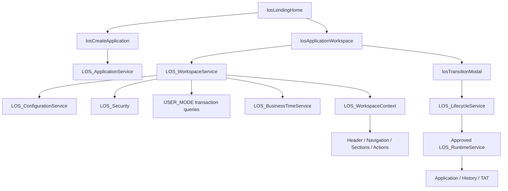

# Task 03 — Unified Lending Workspace

## Architecture and scope

Task 03 adds Lending Home, creation and workspace presentation over the approved runtime. There is no lifecycle engine in JavaScript, no new transactional object, and no lending-domain module. The only foundation addition is `LOS_Security.canEditRecord`, a read-only native-access flag inside the existing security boundary. Commands still perform their original full authorization, version checks, row locks, validation and guarded atomic writes.



The existing RuntimeData and current-TAT facade require parent **edit** access and use approved internal system reads. The workspace also supports read-only records, so its history, timing and persona reads use USER_MODE instead. They do not broaden child sharing. Gross duration calculation reuses the existing business-time abstraction; configuration retrieval/resolution reuses the existing cache. No runtime methods, TAT calculation or registry were redesigned.

## Access and components

Assign `LOS_Lending_User` or `LOS_Platform_Admin`, then use **App Launcher → LOS Lending → Lending Home**. The new Lightning app and component tab are package components. Opening a row or creating an application selects its workspace through a PageReference state key, so bookmarks and browser navigation work. The state namespace is derived from the schema import rather than assuming a future package namespace.

| Component               | Role                                                                                         |
| ----------------------- | -------------------------------------------------------------------------------------------- |
| losLendingHome          | Bounded accessible list, create entry and workspace routing                                  |
| losCreateApplication    | Debounced relationship/baseline search and existing creation command                         |
| losApplicationWorkspace | One wired workspace load, section selection, refresh and modal orchestration                 |
| losApplicationHeader    | Separate Stage, Status, Rework and version; relationship/assignment context                  |
| losWorkspaceNavigation  | Metadata-provided entries                                                                    |
| losApplicationOverview  | Application, organization snapshots and assignment context                                   |
| losApplicationHealth    | Reliable operational indicators only; no credit score                                        |
| losTatIndicator         | Server-measured gross minutes, captured target and visible pause context                     |
| losLifecycleHistory     | Immutable, newest-first visible events                                                       |
| losWorkspaceActions     | Metadata actions routed through controlled handler keys                                      |
| losTransitionModal      | Reason, comments, confirmation and versioned lifecycle command                               |
| losUiUtils              | Safe error presentation, fixed component/handler keys, namespace and dialog keyboard helpers |

Sections mount only when selected. Future heavy components can fetch their own bounded payload after activation; they do not require a new shell architecture. New executable component implementations must first be added to the product allowlist, while configuring existing components requires no LWC business-logic changes.

## WorkspaceContext contract

`LOS_WorkspaceService.getWorkspace(applicationId)` is cacheable and performs no DML. A top-level typed DTO is returned, with top-level child DTO classes rather than an inner-class remote return type.

| Field                                                                      | Contents                                                                                                                                   |
| -------------------------------------------------------------------------- | ------------------------------------------------------------------------------------------------------------------------------------------ |
| application                                                                | Existing LOS_ApplicationDTO: ID, number, type/stage codes, Status, current rework and version                                              |
| relationshipId / relationshipName                                          | Minimal relationship context                                                                                                               |
| stageLabel / applicationTypeLabel                                          | Configured display values                                                                                                                  |
| reworkCount                                                                | Total rework counter, distinct from current rework number                                                                                  |
| primaryRM / currentOwnerUser / currentQueueKey                             | Work-assignment context                                                                                                                    |
| organizationUnit / businessUnitSnapshot / segmentSnapshot / branchSnapshot | Stored application context                                                                                                                 |
| personas                                                                   | Active configured persona codes from visible, effective user/org and team assignments                                                      |
| navigationSections                                                         | Code, label, component key and sequence                                                                                                    |
| actions                                                                    | Applicable action code, handler, section scope, transition code/label/type, reason/validation/confirmation flags and expectedVersion       |
| availableTransitions                                                       | Configured transitions for the current type/stage, only when the caller has edit access and the application is active                      |
| lifecycleHistory / historyHasMore                                          | Up to 50 newest visible events, plus a truncation indicator                                                                                |
| tat                                                                        | Visible current interval, gross duration, stored business/paused minutes, captured target, visible pause flag and availability explanation |
| health / canTransition / loadedAt                                          | Operational messages, action eligibility and server snapshot timestamp                                                                     |

No raw SObjects, authoritative destination-stage command input, unrestricted metadata class names or sensitive account details are exposed. Reason/comments are clipped to 500 characters in the history response. The existing transition command still accepts the full supported length.

## Configuration resolution

Three reference `LOS_Workspace_Section__mdt` records provide Overview, Lifecycle and TAT / Activity. Fourteen `LOS_Workspace_Action__mdt` records provide Refresh and one action referencing each of the 13 existing stage transitions. Stage destinations and transition labels are **not duplicated** in action metadata; the backend takes them from resolved transition configuration.

Sections/actions match optional application type, current stage and persona scope. Empty scope applies globally; a persona scope matches any member of the user's applicable set. Active/effective, user-visible org memberships and team assignments contribute personas; only active metadata persona codes survive. No profile name determines a persona. Up to 201 visible rows per membership source are queried; very large membership catalogs remain an enterprise-scale extension.

Sequence controls ordering; source catalog order is the stable tie-break. Actions scoped to a section require that section to be applicable, and render when it is selected. Transition actions are intersected with the configuration service's available transitions and native edit-access flag. Read-only users retain applicable refresh/navigation but receive no lifecycle actions.

Component keys `OVERVIEW`, `LIFECYCLE` and `TAT` map to compiled product components. Handler keys `TRANSITION` and `REFRESH` map to fixed product behavior. Unknown component, handler, visibility-policy or authorization-policy keys fail closed with a configuration error. Arbitrary LWC/Apex/JavaScript execution from metadata is prohibited. Policy engines are deferred; blank policy keys are the supported baseline. UI action filtering never substitutes for command authorization.

## Visibility and ownership

Lending Home is deliberately labelled **Accessible applications**, not My Work. It shows the latest 50 USER_MODE-visible applications ordered by LastModifiedDate and Id. There is no OwnerId-only filter and no claim that this is a complete enterprise work queue. Salesforce sharing/restriction rules and object/field access determine visibility; assignment and team context remain available in the workspace. A future My Work filter can narrow this authorized set without granting access.

- OwnerId: Salesforce security/record owner.
- LOS_Current_Owner_User__c: current LOS work assignee.
- LOS_Current_Queue_Key__c: logical workflow queue context.
- Application Team: participation and future sharing context; membership itself grants no record access here.

All nine transactional OWD settings remain Private. No sharing engine, broad permission or new automatic share is shipped. Test-only manual Read sharing proves that a read-only parent does not grant child visibility. Because history/TAT/membership objects use independent lookups, a parent share alone may yield partial/no visible history or timing. The UI labels this explicitly and never claims that missing visible data proves no underlying records exist. Administrators must provision authorized context/child access under the existing model; future enterprise sharing remains deferred.

Workspace requests require the existing runtime custom permission and application CRUD contract. All workspace transaction queries run in USER_MODE. Native edit flags are obtained in the existing LOS_Security boundary; system mode is not added to UI reads. Missing CRUD/FLS causes a safe failed request, not a fallback to privileged reads. The permission-set changes grant only the workspace Apex facade, Lightning app visibility and tab visibility. Existing field/object permissions and guards are unchanged.

## Search and creation

Application types and baseline requirements come from metadata. Relationship search requires two trimmed characters, caps input at 80 characters and returns at most 20 active, visible results. Static SOQL binds escape LIKE wildcards and backslashes. Apostrophes remain bound values; there is no dynamic SOQL. The UI debounces for 300 ms and discards responses from superseded searches. Relationship changes clear baseline selection. Baseline search is similarly bounded and restricts results to accessible applications for the selected relationship with an existing approved timestamp.

Creation sends only relationshipId, applicationTypeCode and optional baselineApplicationId to `LOS_ApplicationService.createApplication`. The server remains authoritative. Baseline-required types show baseline UX; Task 03 does not start populating approval dates or implement approval decisions. Reference types requiring an approved baseline therefore need legitimately prepared baseline data from the existing model.

## Transition and refresh contract

```mermaid
sequenceDiagram
    participant U as User
    participant M as Transition modal
    participant L as LOS_LifecycleService
    participant R as LOS_RuntimeService
    participant W as Workspace
    U->>M: Choose configured action; reason/comments/confirmation
    M->>L: applicationId, transitionCode, expectedVersion, reason, comments
    L->>R: Existing transition request
    R->>R: Authorize, lock, check version and configured edge
    R->>R: Validate; close TAT; update stage/status/rework/version
    R->>R: Write immutable history and new TAT atomically
    L-->>M: Result or client-safe error
    M->>W: Completion / stale event
    W->>W: refreshApex on the complete WorkspaceContext
```

JavaScript does not select destinations, calculate Status/rework, or authorize transitions. Every lifecycle action carries the workspace version. On stale error, the modal closes, no command is retried, the complete context refreshes, and the user is told to review the new state before acting. Detection uses the existing client-safe stale message because the approved facade does not yet expose structured error codes. A future additive typed error code would remove that text dependency.

The modal trims reason/comments and sends null for blank optional text. The browser test exposed that empty strings are normalized during DML and do not satisfy the existing exact-value write guard; this presentation adapter normalization preserves the approved runtime contract. A rollback-only server check and a focused Jest regression verify the fix.

Successful transitions and configured Refresh actions call `refreshApex` on the one workspace wire. Stage, Status, actions, sections, version, history and TAT are replaced together. Local navigation selection persists only if still applicable. No authoritative fields are patched optimistically. Read/query/configuration/TAT errors are shown, and unexpected errors are sanitized through the existing server exception boundary and common UI helper.

## Timing, history and performance

The UI shows gross elapsed minutes calculated on the server at the last refresh, stage start, captured SLA target, stored business minutes and completed-pause totals. It does not run a browser time/SLA/calendar engine, claim a risk score, or invent remaining/overdue business minutes. Open pauses are labelled according to visibility. Business calendars and pause/resume controls remain deferred.

History is included in the single initial payload: query 51 rows, return 50, newest timestamp/CreatedDate/Id first. This bounds both query and payload and permits a has-more message. History has no edit/delete controls; existing guards remain authoritative.

Limits: application list 50, relationship/baseline search 20, history 50, membership sources 201 each, text excerpts 500. No SOQL occurs in workspace loops. Catalogs use the existing per-transaction cache. The focused test requires fewer than 25 queries and under 50 KB for a normal initial workspace, and confirms zero DML. A deployed-org measurement returned **13 queries, zero DML, and 2,396 JSON characters** for the initial synthetic workspace; see [performance evidence](task-03-performance.json). Configuration catalogs are expected to remain small; enterprise work queues and full history pagination are deferred.

## Development and validation

```sh
npm ci --ignore-scripts
npm run test:unit -- -- --runInBand
npm run lint
python3 scripts/validation/validate_foundation.py
sf project deploy start --source-dir force-app --target-org closDevOrg \
  --dry-run --test-level RunLocalTests --wait 10 --json
sf project deploy start --source-dir force-app --target-org closDevOrg \
  --test-level RunLocalTests --wait 10 --json
python3 scripts/validation/verify_deployed.py --target-org closDevOrg \
  --expect-reference-data --output docs/task-03-org-verification.json
```

Jest infrastructure already existed. The lockfile now pins its dependencies; the lint script tolerates absent Aura source. Eleven Jest tests cover rendering/loading/errors, separate Stage/Status, metadata navigation, unsafe component rejection, reason/confirmation, creation search/command, successful refresh and stale handling. Ten new Apex tests cover the workspace, privacy/read-only sharing, metadata controls, persona context, searches, list bounds, creation/baselines, rework/history/TAT and stale versions. All earlier regression tests remain intact.

Optional synthetic fixture: `sf apex run --target-org closDevOrg --file scripts/apex/los_task03_fixture.apex`. It creates only a demo Account, organization unit and Relationship in user mode and lives outside the package. Credit Application creation for the manual scenario occurs through Lending Home.

## Package and scope findings

All product components remain under `force-app`, use LOS_ / los naming, and have no manually invented namespace. Metadata seeds are client-neutral. App navigation state derives namespace from a schema import. No hard-coded org/user/profile/record-type IDs, client names, environment endpoints/usernames or closDevOrg runtime dependency are introduced. Standard Salesforce/W3C XML URLs are schema identifiers. Existing test-only profile-name lookup and generated example.invalid usernames remain fixtures. Actual 2GP creation/install tests and security review are deferred.

The dependency installation reports deprecations in existing development-tool transitive packages; these are not deployed to Salesforce. No framework/tooling migration is included.

Deferred: enterprise sharing/work queues, more than 50 applications/history events in the initial UI, runtime repair, business calendars, pause/resume UI, approval authorities, booking integrations, all borrower/facility/financial/collateral/covenant/document/monitoring modules and analytics. No placeholder business objects or fake module screens were created.

## Required architecture answers

A. **No material foundation modification.** One additive native edit-access helper; no existing command/security behavior changed.

B. **No lifecycle business logic in JavaScript.**

C. **Yes:** Stage, Status, transitions and workspace section configuration can change without LWC business-logic changes. New executable modules require explicit allowlist implementation.

D. **Yes:** every lifecycle command includes expectedVersion.

E. **Yes:** Lending Home uses USER_MODE and respects Salesforce record-level security.

F. **No:** UI visibility rules grant no data access.

G. **No:** OWD, sharing and runtime guards were not weakened.

## Completion report

**Task 03 passed deployment, automated tests and the browser end-to-end scenario.** Open App Launcher → LOS Lending → Lending Home. The synthetic application is `APP-00000001` on relationship `LOS_UI_DEMO`; unrelated user records were not changed.

| Validation                                      | Result                                                          |
| ----------------------------------------------- | --------------------------------------------------------------- |
| Final deployment                                | `0Afbm00000hFjbxCAC` — Succeeded, 328 components                |
| Test level                                      | RunLocalTests                                                   |
| Apex                                            | 61/61 passed: existing 51 plus 10 workspace tests               |
| Aggregate executable-line coverage              | 1,497 / 1,618 = 92.52%; no coverage warnings                    |
| Jest                                            | 11/11 tests in 4 suites passed                                  |
| ESLint                                          | Passed                                                          |
| Offline foundation validation                   | 8/8 passed                                                      |
| Deployed metadata verification                  | Passed; 9 Private objects and 5 active guard triggers preserved |
| Package source scan                             | No production findings; 2GP install verification deferred       |
| Initial workspace measurement                   | 13 queries, zero DML, 2,396 JSON characters                     |
| Browser lifecycle/rework/refresh/stale scenario | Passed                                                          |

Exact final deployment command:

```sh
sf project deploy start --source-dir force-app --target-org closDevOrg --test-level RunLocalTests --wait 1 --json
sf project deploy report --job-id 0Afbm00000hFjbxCAC --target-org closDevOrg --json
```

The one-minute command wait elapsed while deployment continued; the report confirmed successful completion. See [machine-readable results](task-03-results.json), [org verification](task-03-org-verification.json), [browser evidence](task-03-browser-verification.json), and [package scan](task-03-package-scan.json).

### Browser scenario

Creation and all six required transitions ran through Chrome, using the deployed LWC and existing Apex facades:

| Step                | Stage         | Status      | Rework | Version |
| ------------------- | ------------- | ----------- | -----: | ------: |
| Create              | Draft         | In Progress |      0 |       0 |
| Forward             | Underwriting  | In Progress |      0 |       1 |
| Forward             | RM/TL Review  | In Review   |      0 |       2 |
| Forward             | Credit Review | In Review   |      0 |       3 |
| Rework, with reason | Underwriting  | In Progress |      1 |       4 |
| Forward             | RM/TL Review  | In Review   |      1 |       5 |
| Forward             | Credit Review | In Review   |      1 |       6 |

The header displayed Stage and Status separately. Configured actions changed with each stage. Lifecycle navigation showed seven newest-first, read-only events including the rework reason. TAT navigation showed the current interval and labelled gross time/business-calendar limitations. Refresh preserved stage, status, rework and version.

For concurrency, the browser held a Return to Draft dialog at version 6. An anonymous Apex test invoked the existing lifecycle facade on only the synthetic application, returning it to Underwriting at version 7/rework 2. Submitting the old browser dialog was rejected. The modal closed, a clear stale-state message appeared, and the complete workspace refreshed to version 7 with no automatic retry. The synthetic application is intentionally left in that resulting state.

A final USER_MODE query/assertion check confirmed eight history events and eight matching TAT intervals, exactly one open interval matching Underwriting/rework 2, and version 7. There was no history or TAT write from the stale request. This also verified that TAT followed every stage of the required scenario.

The initial browser attempt exposed blank optional strings at the existing write-guard boundary. The fix is confined to the modal's input adapter (trimmed text or null), with a Jest regression. Chrome initially retained older component code; a temporary cache-bypassing reload loaded the deployed fix and the blank-field transition passed. Browser caching was restored, DevTools closed, and the temporary diagnostic TraceFlag deleted. No foundation workaround or bypass was introduced.

### Files and metadata

Added Apex: `LOS_WorkspaceService`, `LOS_WorkspaceServiceTest`, `LOS_WorkspaceContext`, `LOS_WorkspaceActionDTO`, `LOS_WorkspaceApplicationDTO`, `LOS_WorkspaceHistoryDTO`, `LOS_WorkspaceOptionDTO`, `LOS_WorkspaceSectionDTO`, and `LOS_WorkspaceTatDTO` (each with its metadata descriptor).

Added 12 LWC bundles: the 11 UI components and `losUiUtils` listed above; four bundles include Jest tests. Added three workspace section seeds, fourteen workspace action seeds, the LOS Lending Lightning app and Lending Home tab. No objects, fields, stages or transition edges were added or removed. Both permission sets gain only the workspace class, app visibility and tab visibility.

Modified files: README, the additive LOS_Security helper, two permission sets, manifest, package.json lint command, and two validation scripts. Added documentation/evidence, dependency lockfile and the separate synthetic fixture. The [exact file inventory and Git summary](task-03-file-inventory.md) lists every created and modified file. No commit was created and no unrelated parent-workspace file was modified.

Known limitations remain those documented above: bounded initial lists/history, independently shared child records, no enterprise work queue/sharing engine or business calendars, and no package install test. The browser test used the authenticated development user; restricted-user access and read-only behavior were covered by Apex tests. CLI update notices and existing development-dependency deprecations did not affect deployment.

Stop after Task 03. The next gate is **Task 03 architecture and source review**.

Sources: Salesforce documents the [Apex/LWC return contract](https://developer.salesforce.com/docs/platform/lwc/guide/apex-expose-method.html), [navigation and PageReference state](https://developer.salesforce.com/docs/platform/lightning-component-reference/guide/lightning-navigation.html), and [client-safe Apex errors](https://developer.salesforce.com/docs/platform/lwc/guide/apex-error-handling.html).
